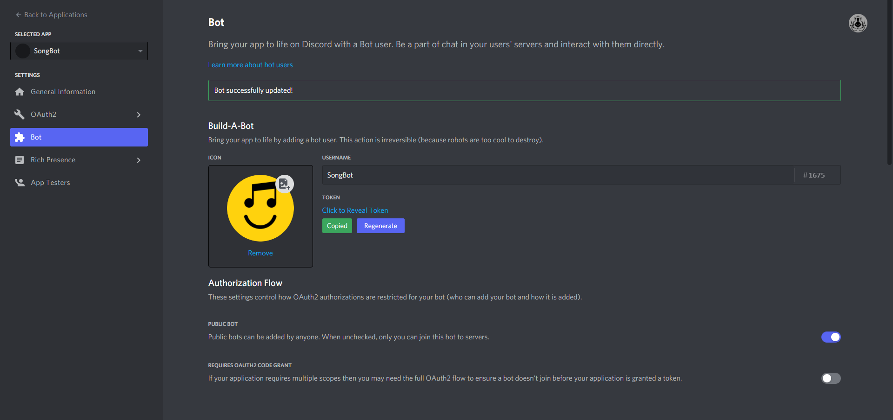

<h1>SongBot 🎶</h1>

<h2>Tuto pour crée un bot musical avec discord.js</h2>

<h3>Etape 1 :</h3>
Récupére le code en utilisant la commande git clone https://github.com/Woulfty/SongBot dans le terminal de Visual Studio Code.

<h3>Etape 2 :</h3>
Crée une nouvelle application sur le DEVELOPER PORTAL : https://discord.com/developers/applications.

<h3>Etape 3 :</h3>
Définie ton application en tant que bot dans l'onglet "Bot".

<h3>Etape 4 :</h3>
Récupére le token de ton bot dans l'onglet "Bot" et met le dans le dossier config.json dans Visual Studio Code.

<h3>Etape 5 :</h3>
Utilise la commande npm install discord.js@^12.5.3 ffmpeg fluent-ffmpeg @discordjs/opus ytdl-core --save pour instaler la librairie ytdl et le dossier ffmpeg qui te permetera de lire les musiques et ainsi faire fonctionner ton bot.
En cas de problème avec les dossiers ffmpeg utilise la documentation sur ce site : http://ffmpeg.org/download.html.

<h3>Etape 6 : </h3>
Profite de ton bot et ajoute les modifications que tu souhaite pour faire progresser ton bot. Bonne chance !
